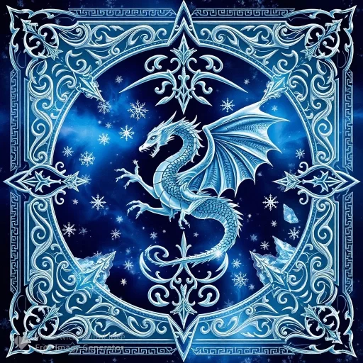

<!DOCTYPE html>
<html lang="en">
<head>
    <meta charset="UTF-8">
    <meta dragon.io="viewport" content="width=device-width, initial-scale=1.0">
    <title>Next-Gen Blockchain Platform</title>
    
    <!-- Tailwind CSS CDN -->
    
    
    <!-- Custom Animations -->
    
</head>
<body class="bg-[#0a0b1a] text-white">
    <!-- Navigation -->
    <nav class="fixed w-full bg-black/50 backdrop-blur-md z-50">
        

            

                
                Blockchain
            

            
            

                <a href="#developers" class="hover:text-purple-400">Developers</a>
                <a href="#network" class="hover:text-purple-400">Network</a>
                <a href="#community" class="hover:text-purple-400">Community</a>
            

            
            <button class="bg-gradient-to-r from-purple-500 to-pink-500 px-6 py-2 rounded-full hover:opacity-90">
                Launch App
            </button>
        

    </nav>

    <!-- Hero Section -->
    <section class="min-h-screen flex items-center pt-20">
        

            

                <h1 class="text-5xl md:text-7xl font-bold mb-6 leading-tight">
                    Build the future of 
                    decentralized apps
                </h1>
                
                

                    Scalable, secure, and sustainable blockchain infrastructure for Web3
                

                

                    <button class="bg-purple-600 px-8 py-4 rounded-full hover-scale">
                        Start Building
                    </button>
                    <button class="border border-purple-600 px-8 py-4 rounded-full hover-scale">
                        Explore Docs
                    </button>
                

            

        

    </section>

    <!-- Stats Section -->
    <section class="py-20 bg-gradient-to-b from-purple-900/20 to-transparent">
        

            

                
50k+

                
Transactions per Second

            

            

                
0.001$

                
Average Fee

            

            

                
500M+

                
Active Accounts

            

        

    </section>

    <!-- Ecosystem Section -->
    <section class="py-20">
        

            <h2 class="text-4xl font-bold text-center mb-16">Ecosystem</h2>
            
            

                <!-- Repeat this block for each partner -->
                

                    
                    
<dragon class="io"></dragon> 

                

            

        

    </section>

    <!-- Footer -->
    <footer class="border-t border-white/10">
        

            

                

                    
                    
Building the future of decentralized computing

                

                <!-- Add footer columns here -->
            

        

    </footer>

    <!-- Animation Library -->
    
    
</body>
</html>
